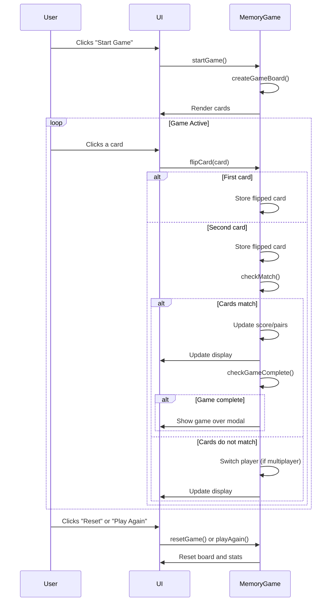

# Memory Game Sequence Diagram

Below is a Mermaid JS sequence diagram that visualizes the main steps in the memory game:

```mermaid
sequenceDiagram
    participant User
    participant UI
    participant MemoryGame

    User->>UI: Clicks "Start Game"
    UI->>MemoryGame: startGame()
    MemoryGame->>MemoryGame: createGameBoard()
    MemoryGame->>UI: Render cards

    loop Game Active
        User->>UI: Clicks a card
        UI->>MemoryGame: flipCard(card)
        alt First card
            MemoryGame->>MemoryGame: Store flipped card
        else Second card
            MemoryGame->>MemoryGame: Store flipped card
            MemoryGame->>MemoryGame: checkMatch()
            alt Cards match
                MemoryGame->>MemoryGame: Update score/pairs
                MemoryGame->>UI: Update display
                MemoryGame->>MemoryGame: checkGameComplete()
                alt Game complete
                    MemoryGame->>UI: Show game over modal
                end
            else Cards do not match
                MemoryGame->>MemoryGame: Switch player (if multiplayer)
                MemoryGame->>UI: Update display
            end
        end
    end

    User->>UI: Clicks "Reset" or "Play Again"
    UI->>MemoryGame: resetGame() or playAgain()
    MemoryGame->>UI: Reset board and stats
```
# memory-game-test
A memory game test repository
